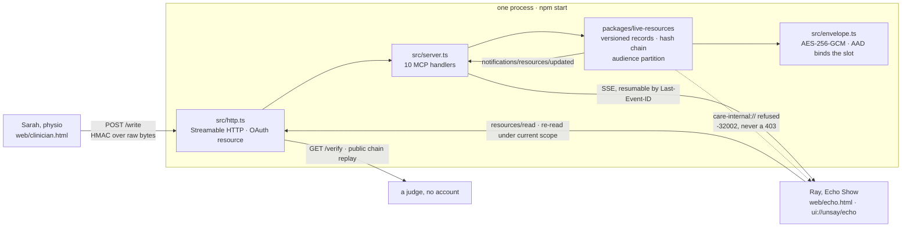

# Architecture

> **Generated from the codebase** by `scripts/gen_architecture.ts` — run `npm run docs:arch`.
> Every table below is read out of the source: if a surface is listed, code for it exists
> in `src/` or `packages/`. Two sections are authored rather than derived — the diagram
> and [Not built](#not-built) — and both say so where they appear, because a shape and an
> absence cannot be parsed out of code.
> LESSONS R6: eight prior submissions documented routes that were never built.

_Generated: 2026-09-28T14:04:00.086Z_

## Protocol

| | |
|---|---|
| MCP specification | `2025-11-25` — `LATEST_PROTOCOL_VERSION` in the pinned SDK |
| Transport | Streamable HTTP (`StreamableHTTPServerTransport`), with `Last-Event-ID` resume |
| Hosting | self-hosted; `npm start` runs one process on one origin |
| Track requirement | Alexa+ asks for a self-hosted MCP server implementing **2025-11-25** (minimum) over Streamable HTTP |

`scripts/e2e.ts` and `scripts/verify.ts` §6 both assert the NEGOTIATED version at
runtime and exit non-zero below that floor, so this row cannot drift from the wire.

## The shape

_Authored, not derived — the tables below are the machine-checked copy._



## MCP surfaces actually registered

| Protocol method | Registered in |
|---|---|
| `tools/call` | `src/server.ts` |
| `completion/complete` | `src/server.ts` |
| `prompts/get` | `src/server.ts` |
| `prompts/list` | `src/server.ts` |
| `resources/templates/list` | `src/server.ts` |
| `resources/list` | `src/server.ts` |
| `tools/list` | `src/server.ts` |
| `resources/read` | `src/server.ts` |
| `resources/subscribe` | `src/server.ts` |
| `resources/unsubscribe` | `src/server.ts` |
| `notifications/message` | `src/server.ts` |
| `notifications/resources/list_changed` | `packages/live-resources/src/notifier.ts` |
| `notifications/resources/updated` | `packages/live-resources/src/notifier.ts` |

**10 request handlers + 3 notification sender(s).**

Declaring `logging` also makes the SDK serve `logging/setLevel` without a handler of
our own, so it is a surface a host can call but is deliberately not listed above —
this table only names methods with a sender or handler in the source. It is
**honoured**, not merely served: `src/server.ts` passes the transport session id to
`sendLoggingMessage()`, which is what the SDK filters the level against, and
`npm run e2e` asserts a `notice` is suppressed at level `emergency` while
`notifications/resources/updated` still arrives.

## HTTP routes

| Route | Methods | Auth |
|---|---|---|
| `/.well-known/oauth-protected-resource` | GET | public (RFC 9728) |
| `/.well-known/oauth-protected-resource/mcp` | GET | public (RFC 9728) |
| `/health` | GET | public |
| `/mcp` | POST · GET · DELETE | Bearer (care.read.user / care.read.assistant) |
| `/verify` | GET | public — a token widens what it lists |
| `/write` | POST | HMAC-SHA256 over the raw body, or Bearer care.write |
| `/index.html` (and `/`) | GET · HEAD | public — served from `web/` |
| `/clinician.html` | GET · HEAD | public — served from `web/` |
| `/echo.html` | GET · HEAD | public — served from `web/` |
| `/judge` | GET · HEAD | public — `JUDGE.md` rendered by `src/docpage.ts` |
| `/doc/readme` | GET · HEAD | public — `README.md` rendered by `src/docpage.ts` |
| `/doc/demo` | GET · HEAD | public — `DEMO.md` rendered by `src/docpage.ts` |
| `/doc/architecture` | GET · HEAD | public — `ARCHITECTURE.md` rendered by `src/docpage.ts` |
| `/doc/friction` | GET · HEAD | public — `FRICTION.md` rendered by `src/docpage.ts` |
| `/doc/spec` | GET · HEAD | public — `docs/SPEC.md` rendered by `src/docpage.ts` |

**6 routes + 3 static pages + 6 rendered documents**, all in `src/http.ts`.

Plus a second read-only allowlist — the documents and receipts the landing page
cites, so every link on it resolves against the server a judge is already running:

`/JUDGE.md` · `/README.md` · `/DEMO.md` · `/ARCHITECTURE.md` · `/FRICTION.md` · `/LICENSE` · `/docs/SPEC.md` · `/docs/proof/bench.txt` · `/docs/proof/bench.remote.txt` · `/docs/proof/verify.json` · `/docs/proof/bench.json` · `/docs/proof/live_run.jsonl` · `/docs/proof/probe_subscribe.json` · `/docs/proof/resume.json` · `/skill/SKILL.md` · `/icon.svg` · `/og.png` · `/docs/assets/readme-hero-animated.svg` · `/docs/assets/icon-animated.svg` · `/docs/img/echo-retraction.png` · `/docs/img/verify-route.png` · `/packages/live-resources/src/store.ts` · `/src/server.ts` · `/src/http.ts`

## Declared capabilities

```js
resources: { subscribe: true, listChanged: true },
completions: {},
prompts: {},
// A second, cheap notification channel. Declaring it also makes the SDK
// serve logging/setLevel, so a host can turn the revision log down.
logging: {},
tools: {},
```

## Modules

| File | Exports |
|---|---|
| `src/audit.ts` | `AuditLog` |
| `src/blobs.ts` | `EXERCISE_CLIP`, `GAIT_NOTE`, `CLIPS`, `blobFor` |
| `src/docpage.ts` | `DOC_PAGES`, `slugify`, `resolveDocLink`, `renderMarkdown`, `describeDoc`, `renderDocPage` |
| `src/envelope.ts` | `EnvelopeError`, `MasterKeyMissingError`, `KmsUnavailableError`, `DecryptionFailedError`, `EnvelopeKeyMismatchError`, `describeSealed`, `Envelope`, `startupLine`, `announceOnce`, `LocalKeyProvider`, `KmsKeyProvider`, `envelopeFromEnv` |
| `src/http.ts` | `DEV_TOKEN_SECRET`, `DEV_WRITE_SECRET`, `SCOPES_SUPPORTED`, `WRITE_SKEW_MS`, `mintToken`, `TokenError`, `verifyToken`, `writeSigningMaterial`, `signWriteBody`, `urisNamedBy`, `replayAllowed`, `MemoryEventStore`, `createHttpServer` |
| `src/retraction.ts` | `GLOSSARY`, `spokenAge`, `glossesFor`, `renderRetraction` |
| `src/seed.ts` | `RAY`, `DEMO_NOW`, `seed`, `seedDemo`, `STAGED_REVISION` |
| `src/server.ts` | `SERVER_INSTRUCTIONS`, `RESOURCE_PAGE_SIZE`, `BRIEF_CARER`, `buildServer` |
| `src/store.ts` | `CARE_PARTITION`, `uriFor`, `parseUri`, `LiveResourceStore` |
| `src/types.ts` | `SCHEME`, `SCOPE` |
| `src/ui_resource.ts` | `UI_ECHO_URI`, `UI_MIME_TYPE`, `UI_TEMPLATE_META`, `UI_FRAME_META`, `uiHtml`, `uiResourceDescriptor` |

## Extracted package

The generic half — versioned resources, revision notifications, the hash chain,
and the audience/scope partition — lifted out of `src/` so it can be depended on
without Unsay. Consumed here by relative import; not published to npm.

| File | Exports |
|---|---|
| `packages/live-resources/src/chain.ts` | `hashVersion`, `AAD_SEPARATOR`, `recordAad` |
| `packages/live-resources/src/codec.ts` | — |
| `packages/live-resources/src/errors.ts` | `LiveResourceError`, `NotFoundError`, `ReservedSeparatorError`, `PartitionConfigError` |
| `packages/live-resources/src/index.ts` | — |
| `packages/live-resources/src/notifier.ts` | `ResourceNotifier` |
| `packages/live-resources/src/partition.ts` | `AUDIENCES`, `AudiencePartition`, `DEFAULT_PARTITION` |
| `packages/live-resources/src/store.ts` | `LiveResourceStore` |
| `packages/live-resources/src/types.ts` | — |

## Executable scripts

| Command | File |
|---|---|
| `npm run start` | `scripts/serve.ts` |
| `npm run probe` | `scripts/probe_subscribe.ts` |
| `npm run probe:resume` | `scripts/probe_resume.ts` |
| `npm run test` | `test/**` |
| `npm run typecheck` | `tsc --noEmit` |
| `npm run verify` | `scripts/verify.ts` |
| `npm run e2e` | `scripts/e2e.ts` |
| `npm run bench` | `scripts/bench.ts` |
| `npm run seed` | `scripts/seed_dump.ts` |
| `npm run fixtures` | `node --experimental-strip-types fixtures/gen.ts` |
| `npm run keygen` | `node -e "console.log(require('node:crypto').randomBytes(32).toString('hex'))"` |
| `npm run docs:arch` | `scripts/gen_architecture.ts` |
| `npm run e2e:browser` | `playwright test` |
| `npm run e2e:browser:ui` | `playwright test --ui` |
| `npm run lighthouse` | `npx -y @lhci/cli@0.15.1 autorun` |

## Runtime dependencies

| Package | Version | Used in |
|---|---|---|
| `@modelcontextprotocol/sdk` | `^1.30.0` | `src/http.ts`, `src/server.ts`, `packages/live-resources/src/notifier.ts`, `scripts/bench.ts`, `scripts/e2e.ts`, `scripts/probe_resume.ts`, `scripts/probe_subscribe.ts`, `scripts/verify.ts` |

## Not built

The one authored section in this file — every table above is derived from the
source, this list is written by hand in `scripts/gen_architecture.ts` because
absence cannot be parsed out of code. Stated so this document cannot imply otherwise:

- **No AWS deployment.** `npm start` runs the server locally and nothing is hosted. The KMS
  provider in `src/envelope.ts` is SigV4-signed and shaped correctly but has never been
  executed against a live CMK — see FRICTION.md F-004, the payment-verification hold.
- **No authorization server.** Unsay is an OAuth 2.1 protected RESOURCE only: no `/authorize`,
  no `/token`, no refresh, no revocation, no JWKS. Tokens are HS256 under a shared secret,
  minted by `mintToken()` in the same file that verifies them.
- **No durable storage.** The store, the event store and the audit log are in memory; the
  audit log survives only if `UNSAY_AUDIT_LOG` names a file.
- **The MCP Apps binding is shaped, not exercised.** `ui://unsay/echo` is served and
  read over the protocol by `npm run e2e`, but no host we can reach implements the
  extension, so the `_meta` template binding on `whats_changed` has never been
  rendered by one — see FRICTION.md F-013.
- No ML model of any kind, by design — the reasoning model belongs to the host.
- No blockchain, token, or payment surface.
