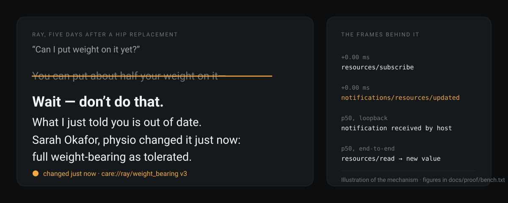
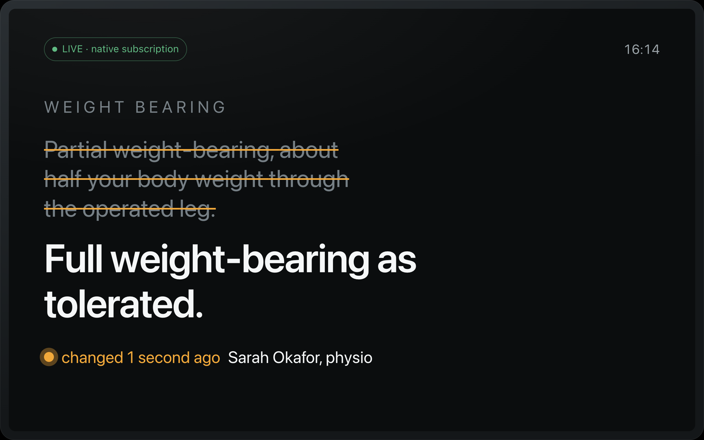
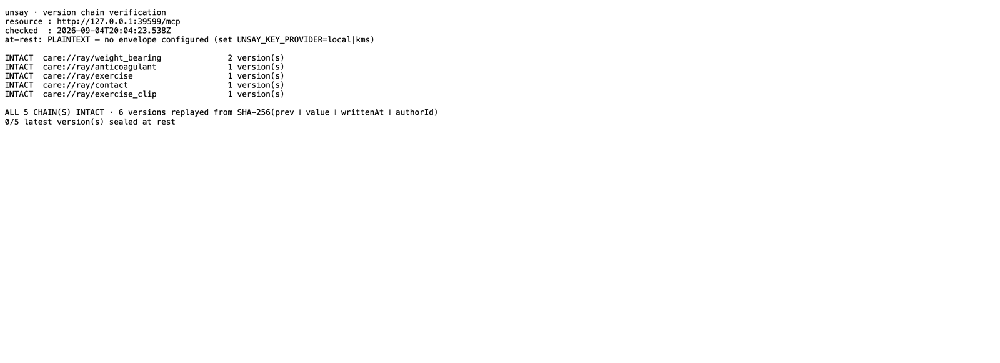

<div align="center">


# Unsay

**The assistant that can be corrected.**

An MCP server whose resources can be revised mid-sentence — so an assistant can stop,
retract what it just said, and name what changed, who changed it, and how long ago.



[](DEMO.md)
[](docs/SPEC.md)
[](FRICTION.md)
[](https://amazonappdev2026.devpost.com/)

*No Live or Video badge: nothing is deployed and no video is recorded. A badge for an artifact
that does not exist is the failure this repository is written against.*


[**Reproduce it**](DEMO.md) · [**Architecture**](ARCHITECTURE.md) · [**Spec & threat model**](docs/SPEC.md) · [**Friction log**](FRICTION.md) · [**Agent Skill**](skill/SKILL.md)

</div>

---

> **Ray Dunn is 68, five days home after a hip replacement, and he is about to put his full
> weight on a leg his physio changed the instructions for thirty seconds ago.**

Built for the **Alexa+** track of the Amazon Developer Hackathon (Build, Ship, Shape):
a **self-hosted MCP server implementing spec `2025-11-25` over Streamable HTTP**, plus an
**Agent Skill** ([`skill/SKILL.md`](skill/SKILL.md)) and an **MCP Apps** card served as a
resource at `ui://unsay/echo`. `npm run e2e` and `npm run verify` both assert the negotiated
protocol version and exit non-zero below that floor, so the eligibility requirement is checked
rather than claimed.

## 📸 See it in Action

`npm start` runs one process on one origin and prints three links, two of which already carry a
minted token — the landing page carries none because it needs none, and it hands out its own.
There is no build step and no account.

| Screen | What it is | Where |
|---|---|---|
| **Ray's Echo Show** | 1280×800 device card. The retracted line strikes through, the new instruction replaces it, and the provenance line names the physio and the age. Also served over MCP as `ui://unsay/echo`. | [`web/echo.html`](web/echo.html) · `/echo.html` |
| **The physio's screen** | One tap, one confirm. Signs the body with HMAC-SHA256 **in the browser** and posts it; with no server reachable it signs anyway and hands you the `curl` to replay, and never claims to have published. | [`web/clinician.html`](web/clinician.html) · `/clinician.html` |
| **The landing page** | The mechanism, the safety property, the latency with its caveat attached, and every proof command. | [`web/index.html`](web/index.html) · `/index.html` |

Open the Echo Show link and the clinician link side by side, type a new instruction and publish
it: the device screen strikes the old line through, the receipt underneath the write reports the
round trip it measured, and the assistant has what it needs to retract.



That is a **photograph of the running product**, not a mock-up: `npm start`, the device page
subscribed over MCP, and a real signed `POST /write` that the server answered
`{"subscribers":1,"notified":true}`. Shot inside the window before the struck line fades.

`GET /verify` is the one link that proves the chain without cloning anything — public,
unauthenticated, and rendered for whoever asks:



The hero at the top of this file is an **illustration** of the mechanism, drawn from the committed
seed record. The two images in this section are not. There is no demo video yet and no hosted URL;
see [What is not here](#what-is-not-here).

## 💡 The Problem & Solution

**The moment.** A weight-bearing instruction after hip or knee arthroplasty is a *status*, and it
changes: non-weight-bearing, then partial, then full as tolerated, on a schedule that moves when
the surgeon or the physio sees how the patient is doing. The patient is at home. The instruction
that reaches them travels by phone call to a landline, or on a printed sheet written on the day
of discharge, or in a letter. When the status changes on a Tuesday, the sheet on the fridge still
says Monday's. The person acting on it is post-operative, often alone, and has no way to tell
that the sentence they are reading has been superseded.

**What Unsay replaces.** Not the clinician, and not the record system. The *delivery* of a
changed instruction to the place the patient actually asks the question — which today is a call
that has to be answered and a sheet that has to be reprinted. Unsay makes the fact itself
correctable: the assistant that already answered "about half your weight" is told, in the same
breath, that it was wrong, and by whom, and how long ago.

**Who buys it.** A discharge or therapy team inside a hospital, not a consumer. They already own
the plan and already carry the risk of a superseded instruction being followed. What they get is
a channel with a receipt: every change signed, attributable, hash-chained, and replayable at
`GET /verify` by someone holding the audit log and no key.

**No numbers, on purpose.** This repository does not quote a figure it did not measure, and that
rule does not get suspended for the market-size paragraph. The numbers in this README are the
ones the scripts produced. An arthroplasty volume, or a readmission rate attributable to
instruction error, would have to come from a source — the National Joint Registry's annual
report, NHS England discharge statistics, HCUP in the United States — and be quoted with its year
and its denominator. That work has not been done here, and inventing it would falsify the one
claim the project actually makes.

**Beyond healthcare, shown rather than asserted.** The mechanism is domain-free and it already
runs somewhere else: [`packages/live-resources`](packages/live-resources) ships a standalone suite
of 29 whose scenario is an **incident channel** — a status page an on-call engineer reads while the root
cause is still being written, with a `incident-internal://` lane for the half that is under legal
review. The same shape fits an on-call runbook that changes mid-incident, and a price or
inventory an agent is quoting while it moves. Each would need its own two schemes and two scopes;
nothing else changes.

**After 2026-10-23.** Publish `@unsay/live-resources` to npm. File F-002 and F-003 to the MCP
specification repository by **2026-09-20** — the send-by date is in `FRICTION.md`, because a
draft with no send date is a loss in progress. Put the fresh-clone demo in front of five
clinicians who did not build it.

## 🏗️ Architecture & Tech Stack

Everything in this repo that is not about hips, physios or Alexa lives in
[`packages/live-resources`](packages/live-resources) — `@unsay/live-resources`, MIT.

It is the mechanism, without the domain: versioned resources that fire
`notifications/resources/updated` when they change, a hash chain so "this is current"
and "this descends from what you were told" are checkable instead of asserted, and the
audience/scope partition that keeps reasoning-only content off a speaker even when the
host ignores `annotations.audience`. Any MCP server publishing mutable state needs the
same four things.

`src/store.ts` is now ~115 lines that bind that package to `care://` URIs and adapt
this repo's KMS envelope onto its codec seam. The enforcement point a judge should read is
[`packages/live-resources/src/store.ts`](packages/live-resources/src/store.ts) `read()`, about
fifteen lines. Nothing is duplicated between the two, and nothing is published to npm — the
package is consumed from source by relative import.

| Layer | What it is | Where |
|---|---|---|
| Protocol | MCP `2025-11-25` over **Streamable HTTP**, `@modelcontextprotocol/sdk` — the one runtime dependency | [`src/server.ts`](src/server.ts) |
| Transport & auth | One Node `http` server: `/mcp`, RFC 9728 metadata, HMAC-signed `/write`, public `/verify`, the three pages, and the rendered documents | [`src/http.ts`](src/http.ts) |
| Mechanism | Versioned records, the SHA-256 chain, the audience/scope partition, the notifier | [`packages/live-resources`](packages/live-resources) |
| At rest | AES-256-GCM with `patient\|domain\|version\|audience` as AAD; local HKDF or AWS KMS | [`src/envelope.ts`](src/envelope.ts) |
| Surfaces | Three single-file pages, no framework, no build step, no network fetch | [`web/`](web) |
| Runtime | Node ≥ 22 native type stripping — `tsc --strict` type-checks it, nothing compiles it | `package.json` |

[`ARCHITECTURE.md`](ARCHITECTURE.md) is **generated** from the handler registrations by
`npm run docs:arch`, precisely so it cannot drift into fiction; `scripts/check_submission_readiness.py`
regenerates it and fails if the committed copy differs.

## 🏆 Alexa+ Integration

Three things in this repo exist only because the track is Alexa+, and each is exercised on the
judged path rather than described:

| Artifact | What it is | Exercised by |
|---|---|---|
| [`skill/SKILL.md`](skill/SKILL.md) | An **Agent Skill**: the two-rule retraction protocol, the retraction's required shape, the never-speak rule, and the `whats_changed` fallback. The same contract the server sends in `initialize`. | `npm run e2e` reads it and prints its size; `test/server.test.ts` asserts it has not drifted from `SERVER_INSTRUCTIONS` |
| `ui://unsay/echo` | An **MCP Apps** resource: the 1280×800 device card, served *through* the protocol as `text/html+skybridge` and bound to the `whats_changed` result. Same bytes as `/echo.html` — one file, two doors. | `npm run e2e` reads it over Streamable HTTP; `test/server.test.ts` asserts the mime type, the listing and the tool binding |
| MCP `2025-11-25` | The track's one hard eligibility requirement, over Streamable HTTP with `Last-Event-ID` resume. | asserted at runtime by `npm run e2e` and `npm run verify` §6 |

The `_meta` binding that tells a host to render a tool result *into* the card is **shaped and
unexercised** — no host we can reach implements the extension. That is F-013, and it is disclosed
here for the same reason the KMS provider is.

## 📊 Engineering Rigor

🚧 In development, deadline 2026-10-23. Nothing is deployed; `npm start` runs the whole thing
locally, [`DEMO.md`](DEMO.md) reproduces every block below from an empty clone, and
[`FRICTION.md`](FRICTION.md) ends with the full list of what this build does **not** do.

Every figure in this section is printed by the command above it. Nothing here is transcribed:
`test/docs.test.ts` fails if a quoted table, count or verdict drifts from the receipt that
produced it, and `./scripts/fresh_clone_check.sh` runs each of these commands in a fresh clone.

**The mechanism is proven, not assumed.** `npm run e2e` runs the demo as code against the same
HTTP server `npm start` runs — real Bearer token, cursor-paginated listing, a real audio blob,
the MCP Apps card read over the protocol, the physio's correction arriving through the signed
write path, and the retraction rendered server-side:

<!-- e2e:begin — written by `npm run e2e`, from the run that wrote the receipt. Do not edit by hand. -->
```
  protocolVersion           2025-11-25 ≥ 2025-11-25 — Alexa+ track minimum
  resources/list            9 resources over 3 cursor page(s)
  read  ui://unsay/echo   ← text/html+skybridge · 35146 bytes · MCP Apps card

  Ray's own host reads care-internal://ray/risk
        -32002 Resource not found — same answer as for a URI that does not exist

  tampered write            HTTP 401 · refused, and says nothing about why
  POST /write               HTTP 200 · v3 · 1 subscribed host(s)
  notifications/resources/updated  1.87 ms
  ALEXA "You can put about half your weight on it—"
        Wait — don’t do that. What I just told you is out of date. I said
        “Partial weight-bearing, about half your body weight through the
        operated leg.” Sarah Okafor, physio changed it just now: “Full
        weight-bearing as tolerated.” In plain terms, full weight-bearing
        as tolerated means you can put as much weight through that leg as
        is comfortable.
  _meta unsay/retraction    rendered by src/retraction.ts, not typed into this script
  v3.prevHash === v2.versionHash  YES — the retraction is auditable

  fallback whats_changed    1 revision(s) — exercised, not just built
  logging/setLevel          notice suppressed at level emergency — 0 log message(s) after the write

  PASS — receipt → docs/proof/live_run.jsonl (20 frames + summary)
```

The `1.87 ms` will differ on your machine and between two runs on this one;
it is the only figure in this block that moves, and it is not the headline number — [the bench](#the-number) is.
<!-- e2e:end -->

**The safety properties pass** — `npm run verify` asserts the reads and writes that MUST fail,
do. Thirty-four assertions: fifteen in process, nineteen against a real HTTP server.

```
1. audience partition          ✓ care-internal://ray/{risk,adherence} unreachable with care.read.user
                               ✓ both readable WITH care.read.assistant
2. existence is not leaked     ✓ list() with user scope returns no care-internal:// URI — 5 user URIs
                               ✓ a care:// URI cannot reach an assistant-only record
3. version chain               ✓ chain intact · ✓ tampering v1 breaks it and is located
4. self-announcing staleness   ✓ anticoagulant past stale_after (9.0d) · ✓ exercise NOT flagged (1.0d)
5. audience flip               ✓ publishing an assistant-only record as audience:user is refused
6. OAuth over HTTP             ✓ no token → 401 · ✓ an edited scope claim → 401
                               ✓ care-internal:// unreachable with care.read.user, on any cursor page
                               ✓ the negotiated protocol version is at least 2025-11-25
                               ✓ GET /verify without a token lists no care-internal:// chain
7. encryption at rest          ✓ a ciphertext pasted from care-internal://ray/risk fails to decrypt
                               ✓ and the chain reports it broken at that exact version
8. the signed write path       ✓ unsigned · mutated body · wrong key · stale timestamp → all 401
                               ✓ every refusal left an audit row, and none carries a credential
9. the live entrypoint         ✓ no resource reports a negative age on the default clock
                               ✓ the anticoagulant record is past its review date on the default clock
                               ✓ the record's own text names a stop date that has already passed

PASS — 0 failing assertion(s)
receipt → docs/proof/verify.json
```

Section 9 exists because of a defect that every other gate was structurally unable to see: the
entrypoint seeded its store on a pinned clock and read the wall clock, so `npm start` — the one
command this file sends you to — served `[changed -32d ago by …]` while the whole suite, 184 of
them at the time, stayed green.
It now takes no injected store and no injected clock, which is the only way to test the thing a
stranger runs.

The partition is enforced **server-side by two URI schemes behind two verified OAuth scopes**,
not by trusting `annotations.audience` — because the spec places no obligation on a client to
honour it. See [`FRICTION.md`](FRICTION.md) F-002. Section 7 goes one layer further: AES-256-GCM
whose AAD is `patient|domain|version|audience`, so the partition survives an attacker who owns
the database and simply moves the bytes.

**A correction survives the network dropping under it** — `npm run probe:resume` writes three
revisions while the SSE stream is down and asserts all three are replayed on `Last-Event-ID`:

```
  revision A                  v3 · delivered live
  SSE stream dropped          (as a proxy or a domestic wifi blip would)
  revisions B–D               v4–v6 · written with nothing listening

  PASS  all 3 missed notifications/resources/updated replayed
  PASS  replay arrived on the resumed stream, not the old one

  offline window              803 ms
  write → replayed at client  801 ms

  VERDICT: PASS   (6/6 checks)
```

Three and not one on purpose: a replay that delivered only the last missed notification would
pass a single-revision probe and lose the middle of a correction sequence in the field. The two
timings move run to run; the six checks do not.

<a id="the-number"></a>

**The number**, from `npm run bench -- --n 200` — signed write → HMAC verified → store →
notification → authorized re-read, 200 times. This block is written by the bench script itself,
out of the same run that writes [`docs/proof/bench.txt`](docs/proof/bench.txt):

<!-- bench:begin — written by `npm run bench`. Do not edit by hand; test/docs.test.ts fails if you do. -->
```
segment                             p50        p95        max
signed write → notification       0.8ms      1.2ms      3.8ms
notification → re-read            0.9ms      2.2ms      5.0ms
─────────────────────────────────────────────────────────────
END-TO-END (write → value)        1.7ms      3.3ms      8.5ms

retraction lands mid-sentence in 200/200 runs (100%)
a host was subscribed for every run: yes
```
<!-- bench:end -->

The milliseconds move on every machine and every re-run. The two lines underneath do not, and
`npm run bench` exits non-zero if either of them ever does.

Loopback figures, and the 3,400 ms speech window is an assumed speech rate rather than a
measurement of Alexa+ TTS. Neither is ever quoted as a production number.

Receipts, all committed and all regenerated by the commands above:
[`verify.json`](docs/proof/verify.json) ·
[`probe_subscribe.json`](docs/proof/probe_subscribe.json) ·
[`live_run.jsonl`](docs/proof/live_run.jsonl) ·
[`resume.json`](docs/proof/resume.json) ·
[`bench.txt`](docs/proof/bench.txt)

## 🚀 Getting Started

```bash
npm install
npm start          # → http://127.0.0.1:39500  (landing · Echo Show · clinician)
```

Reproduce every figure in **Engineering Rigor** above rather than taking it:

```bash
npm run verify     # the reads and writes that MUST fail, do
npm run e2e        # the whole demo, as code, over the real server
npm run probe:resume
npm run bench -- --n 200
```

Full walkthrough, verbatim from an empty clone: [`DEMO.md`](DEMO.md).

## 🧪 Testing & CI

**298 tests**, all passing (`npm test`), plus `npm run typecheck` clean under `tsc --strict`.
29 of them belong to [`packages/live-resources`](packages/live-resources) and import only its
public entry point, so they prove that half stands up without the rest of this repo. Another
group runs `web/echo.html`'s own hand-rolled MCP client — sliced verbatim out of the page and
executed against a live server — because the transport a demo video would film was the one
transport nothing ran.

The CI is committed and has **never run**. `.github/workflows/ci.yml` runs the suite, the
type-check and the four scripts — `verify`, `e2e`, `probe`, `probe:resume` — on every push and
every pull request, with no `continue-on-error` anywhere in it;
`.github/workflows/fresh-clone.yml` runs the fresh-clone gate nightly. But this repository has no
remote yet, so no runner has executed either of them, and that is why there is no CI badge in the
header: a badge for a workflow that has never run is the same claim as a Live badge with nothing
deployed. It goes in after the first green run, not before.

The gate that has actually run — locally, not on a runner — is
`./scripts/fresh_clone_check.sh`, which clones to a temp directory with empty
state, installs from scratch, runs every command in [`DEMO.md`](DEMO.md) including the `curl`
walkthrough against a real `npm start`, and exits non-zero if any of it drifts.

Coverage is deliberately not headlined — see [`DEMO.md`](DEMO.md#the-tests) for why, and
`./scripts/fresh_clone_check.sh` for the gate that actually catches what a suite misses.

<a id="what-is-not-here"></a>

## 🚧 What is not here

No deployment, no hosted URL, no demo video, no screenshots of the running screens, no external
users, and nothing published to npm — `packages/live-resources` is extracted and consumed from
source, not released. The AWS KMS provider is SigV4-signed and shaped but has **never been
executed against a live key**. The MCP Apps `_meta` template binding has never been rendered by a
host. No OAuth authorization server is shipped; Unsay is a protected resource only. The gating
question — whether Alexa+ itself declares `capabilities.resources.subscribe`, and re-reads on
`notifications/resources/updated` — has not been answered, which is exactly why the
`whats_changed` fallback is built and exercised.

That last one has a receipt rather than only a sentence: `docs/proof/initialize.json` is committed
with `"status": "not-run"`. It carries the question, the reason it is unrun (the account hold in
`FRICTION.md` F-004), the exact command that will answer it, the fallback that ships either way,
and the four things this project therefore does not claim. It is the one file here whose value is
that it says no.

The full inventory is at the end of [`FRICTION.md`](FRICTION.md) under *What this build does NOT
do*, and the generated [`ARCHITECTURE.md`](ARCHITECTURE.md) closes with the same list.

## 🔥 Friction log

[`FRICTION.md`](FRICTION.md) — fourteen entries, proposing changes to the MCP specification, to
one of its extensions, and to the reference TypeScript SDK. Every one was found by building
against them, and each names the file or the measurement it came from.

## 📄 License

MIT — see [LICENSE](LICENSE).
